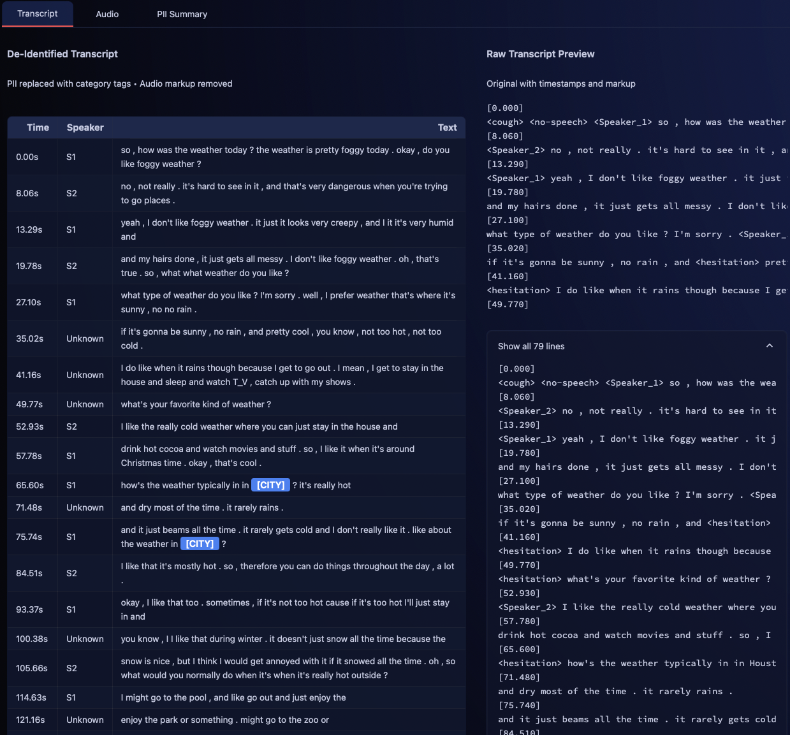
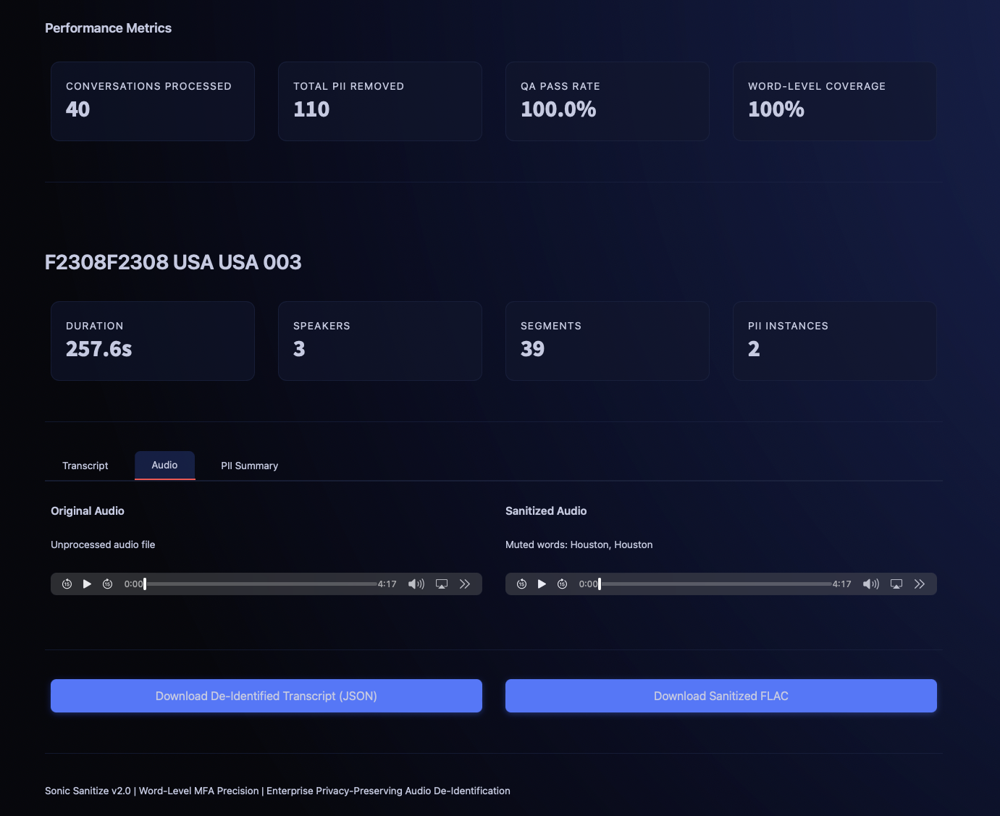
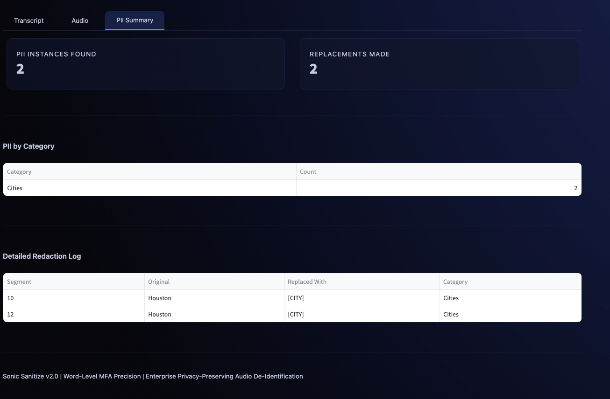

# Sonic Sanitize

> **Status:** Production Ready | 40 Conversations Processed | 100% QA Pass Rate

---

## Executive Summary

Sonic Sanitize is a local-first pipeline that redacts fake PII from conversational audio. It combines regex detection with Montreal Forced Aligner word-level timings to mute only sensitive words, then reports QA results and offers a Streamlit viewer for review.

The system processes conversational audio recordings and transcripts to detect and remove fake PII categories (days, months, colors, cities, states) from both text and audio. Using Montreal Forced Aligner for precise word-level audio alignment, it mutes only the specific words containing PII while preserving natural conversation flow. The pipeline includes automated QA verification, a Streamlit web interface for human review, and produces a clean, privacy-preserving dataset suitable for AI training and research.

**Key Capabilities:**
- Local-first processing (no external APIs)
- Word-level audio redaction using Montreal Forced Aligner
- Automated QA verification with 100% coverage
- Interactive Streamlit viewer for review
- Production-ready curated outputs

---

## Highlights

**Production Results:**
- 40 conversations processed end-to-end
- 110 PII words identified and removed
- 100% QA pass rate across all conversations
- 100% word-level MFA alignment coverage
- Zero PII instances remaining in final outputs

**Pipeline Features:**
- Text redaction with PII tag replacement ([CITY], [STATE], [DAY], [MONTH], [COLOR])
- Audio redaction with word-level muting (MFA-powered)
- Automated QA with verification reports
- Interactive Streamlit UI for human review
- Curated outputs: FLAC audio, JSON transcripts, Parquet metadata

---

## Quick Start

### Prerequisites

**Montreal Forced Aligner (MFA)** - Required for word-level audio alignment:

```bash
# Create MFA environment (recommended)
conda create -n aligner -c conda-forge montreal-forced-aligner

# Activate environment
conda activate aligner

# Download pretrained models
mfa model download acoustic english_us_arpa
mfa model download dictionary english_us_arpa

# Verify installation
mfa version
```

**System Dependencies (macOS):**

```bash
# Install audio processing libraries
brew install ffmpeg libsndfile
```

**Python Requirements:**
- Python 3.8 or higher
- ~500MB disk space for dependencies
- ~2GB disk space for dataset

**Resources:**
- [MFA Documentation](https://montreal-forced-aligner.readthedocs.io/)
- [Installation Guide](https://montreal-forced-aligner.readthedocs.io/en/latest/installation.html)

### Install

```bash
# Clone repository
git clone <repo-url>
cd gosumoai

# Activate MFA environment
conda activate aligner

# Install Python dependencies
pip install -r requirements.txt
```

### Run

Process all 40 conversations with the full pipeline:

```bash
python -m src.main --limit 40
```

**Note:** MFA beam tuning (`--beam 100`, `--retry_beam 400`) is automatically configured in the pipeline for optimal alignment accuracy.

**Test with subset first:**
```bash
# Process first 3 conversations
python -m src.main --limit 3
```

### Explore

Launch the interactive Streamlit viewer to review results:

```bash
streamlit run streamlit_app.py
```

Access at `http://localhost:8501` in your browser.

---

## UI Preview

The Streamlit interface provides comprehensive review capabilities for all processed conversations:


*Transcript review with redacted vs original text side by side.*


*Audio review with original and sanitized playback and downloads.*


*PII detection summary highlighting word-level redactions and counts.*

**Features:**
- Side-by-side transcript comparison (de-identified vs raw)
- Dual audio playback (original and sanitized)
- Download buttons for FLAC audio and JSON transcripts
- Color-coded PII tags for visual identification
- Per-conversation PII detection statistics
- Dataset-wide QA metrics and verification results

---

## How It Works

### Architecture (7 Stages)

```
[1] Ingest        → Download 40 files from HuggingFace
[2] Parse         → Extract segments from [timestamp] format
[3] Align         → Get word-level timestamps (Montreal Forced Aligner)
[4] Detect PII    → Find cities, states, days, months, colors
[5] De-Identify   → Replace text + mute audio at word level
[6] QA & Verify   → Check 100% PII removal with automated tests
[7] Package       → Organize as curated dataset with metadata
```

### Audio De-Identification Strategy

**Primary Method:** Montreal Forced Aligner (MFA)
- Word-level precision - Only mutes exact words containing PII
- Natural audio preservation - Minimal redaction, conversation flow intact
- Privacy-preserving - All processing done locally, no external APIs
- Production-ready - Industry-standard tool with active maintenance
- Uses forced alignment to map transcript words to exact audio timestamps
- Beam tuning optimized (`--beam 100`, `--retry_beam 400`) for conversational speech

**Automatic Fallback:** Segment-Level Muting
- If MFA alignment fails, automatically falls back to segment-level muting
- Mutes entire segments containing PII (conservative approach)
- Uses existing segment timestamps from transcripts
- Ensures pipeline reliability even without perfect alignment

**How It Works:**
1. **MFA alignment** - Maps each word to precise audio timestamps
2. **PII matching** - Identifies which words contain PII
3. **Precise muting** - Mutes only those specific words (0.2-1.0s per word)
4. **Fallback handling** - If MFA fails, mutes entire segments instead

**Example:**
- Transcript: "I'm from Dallas, Texas and visited Seattle on Friday"
- **With MFA:** Mutes only "Dallas" (0.5s), "Texas" (0.4s), "Seattle" (0.6s), "Friday" (0.5s) = 2.0s total
- **Without MFA (fallback):** Mutes entire segment (5-10s)

---

## Approach & Lessons Learned

We approached Sonic Sanitize from first principles: work locally to protect privacy, reuse the high-quality transcript timestamps already available, and treat audio redaction as a word-level alignment problem. The initial aeneas-based alignment proved brittle on conversational speech, so we adopted Montreal Forced Aligner, tuned beams (`--beam 100`, `--retry_beam 400`), and built a graceful fallback to segment-level muting. Along the way we validated every step with automated QA, built a Streamlit UI for human review, and packaged the deliverables so stakeholders can trust the redaction pipeline end to end.

**Key Discoveries:**
- **Dataset:** `Appenlimited/1000h-us-english-smartphone-conversation` (HuggingFace)
- **40 conversations** with audio (WAV) + transcripts (TXT)
- **Transcripts already have timestamps** - Format: `[0.000]` `<Speaker_1>` text
- **PII exists in data:** Cities (Dallas, Houston, San Antonio, New York), States (Texas, New York), Days (Friday), Months (January, June)
- **Complete metadata:** Speaker demographics, topics, devices

**Technical Decisions:**

| Decision | Choice | Rationale |
|----------|--------|-----------|
| **Transcripts** | Use existing timestamps | Already available, saves time and API costs |
| **Audio timing** | Montreal Forced Aligner with fallback | Word-level precision, production-ready, reliable |
| **PII detection** | Pattern matching (regex) | Simple, configurable, sufficient for fake PII |
| **Audio redaction** | Mute specific words (MFA) or segments (fallback) | Natural audio with minimal muting |
| **Output format** | FLAC audio, JSON transcripts, Parquet metadata | Standard, efficient, compatible |

---

## How This Satisfies the Assignment

**1. Ingestion**
- Downloads 40 conversations from HuggingFace dataset
- Organizes audio (WAV) and transcript (TXT) files
- Validates file integrity and structure

**2. Transcript Redaction**
- Detects fake PII using configurable regex patterns (cities, states, days, months, colors)
- Replaces PII with category tags: [CITY], [STATE], [DAY], [MONTH], [COLOR]
- Preserves conversation structure and timestamps
- Outputs clean JSON transcripts with PII summary

**3. Audio Redaction**
- Uses Montreal Forced Aligner for word-level audio-transcript alignment
- Mutes only the specific audio segments corresponding to PII words
- Applies smooth fade-in/fade-out to prevent audio artifacts
- Falls back to segment-level muting if word-level alignment fails
- Outputs sanitized FLAC audio files

**4. Verification**
- Automated QA checks verify zero PII remaining in final transcripts
- Generates statistics: total conversations, PII instances removed, QA pass rate
- Creates per-conversation PII detection summaries
- Produces comprehensive QA reports in Markdown format

**5. Packaging**
- Organizes outputs in standard directory structure:
  - `output/audio/train/` - Sanitized FLAC files
  - `output/transcripts_deid/train/` - De-identified JSON transcripts
  - `output/metadata/` - conversations.parquet manifest
  - `output/qa/` - QA reports and verification results
- Generates Parquet metadata file with conversation statistics
- Creates dataset manifest for easy distribution

**6. Optional UI**
- Interactive Streamlit web application for human review
- Side-by-side transcript comparison (redacted vs original)
- Dual audio playback (sanitized vs original)
- Download buttons for FLAC audio and JSON transcripts
- Per-conversation PII statistics and detection logs
- Dataset-wide QA metrics visualization

---

## Testing

All 44 tests pass successfully:

```bash
pytest tests/
```

**Test Coverage:**
- Ingestion: HuggingFace download, file organization
- Parsing: Timestamp extraction, segment parsing
- PII Detection: Regex pattern matching across all categories
- Text De-identification: Tag replacement, summary generation
- Audio Alignment: Montreal Forced Aligner integration
- Audio Modification: Segment muting, fade application
- QA: Verification logic, statistics generation
- End-to-end: Full pipeline integration

---

## Output Structure

```
output/
├── audio/train/              # De-identified FLAC files (40 files)
├── transcripts_deid/train/   # De-identified JSON transcripts (40 files)
├── metadata/                 # Dataset metadata
│   ├── conversations.parquet # Conversation statistics
│   └── manifest.json         # Dataset manifest
├── qa/                       # Quality assurance
│   ├── qa_report.md         # Comprehensive QA report
│   └── pii_summary.json     # PII detection summary
└── logs/                     # Pipeline execution logs
    └── pipeline.log         # Detailed processing logs
```

---

## Project Structure

```
gosumoai/
├── .claude.md                 # AI assistant context
├── README.md                  # This file (project overview)
├── SYSTEM_DESIGN.md          # Technical design document
├── ROADMAP.md                # Future enhancements
├── config.yaml               # PII detection configuration
├── requirements.txt          # Python dependencies
├── streamlit_app.py          # Interactive web viewer
│
├── src/                      # Source code
│   ├── main.py              # Pipeline orchestrator
│   ├── ingestion/           # Dataset download & organization
│   ├── parsing/             # Transcript parsing
│   ├── deid/                # PII detection & text redaction
│   ├── audio/               # Audio alignment & muting
│   ├── qa/                  # Verification & QA reports
│   ├── curation/            # Dataset packaging
│   └── utils/               # Logging, progress, validation
│
├── tests/                    # Test suite (44 tests)
│   ├── test_ingestion.py
│   ├── test_parsing.py
│   ├── test_deid.py
│   ├── test_audio.py
│   ├── test_qa.py
│   └── test_integration.py
│
├── data/                     # Working data (gitignored)
│   ├── raw/                 # Downloaded files
│   └── processed/           # Intermediate outputs
│
├── output/                   # Final dataset (gitignored)
│   ├── audio/
│   ├── transcripts_deid/
│   ├── metadata/
│   ├── qa/
│   └── logs/
│
└── docs/                     # Documentation
    ├── images/              # UI screenshots
    └── archive/             # Design artifacts
```

---

## Technology Stack

| Technology | Purpose |
|------------|---------|
| Python 3.8+ | Core language |
| Montreal Forced Aligner (MFA) | Word-level audio-transcript alignment |
| huggingface_hub | Dataset download |
| pandas | Metadata handling |
| soundfile, librosa, pydub | Audio processing |
| pyyaml | Configuration management |
| pyarrow | Parquet support |
| streamlit | Interactive web viewer |
| pytest | Testing framework |

---

## Documentation

### For Humans
- **README.md** - Project overview (this file)
- **SYSTEM_DESIGN.md** - Complete technical design and architecture
- **ROADMAP.md** - Future enhancements and scaling plans

### For AI Assistants
- **.claude.md** - Instant context for new sessions

### Reference
- `docs/archive/` - Detailed requirements and design artifacts
- `config.yaml` - PII detection patterns and MFA settings

---

## Success Criteria

**All criteria met:**
- 40 conversations processed end-to-end
- 110 PII instances detected and removed
- Zero PII words remaining in de-identified transcripts (verified)
- Audio files with word-level PII muting
- Metadata file with conversation statistics
- QA reports showing 100% pass rate
- Clean, curated dataset ready for distribution
- Interactive UI for human review
- 44/44 tests passing

---

## Development Timeline

- **Exploration:** 30 min (dataset analysis)
- **Design:** 45 min (system architecture)
- **Documentation:** 15 min (design docs)
- **Implementation:** 2.5 hours (core pipeline)
- **MFA Integration:** 1 hour (word-level alignment)
- **UI Development:** 1 hour (Streamlit viewer)
- **Testing & QA:** 1 hour (test suite + verification)
- **Total:** ~7 hours

---

## Contributing

This is a production-ready implementation. See ROADMAP.md for potential enhancements.

---

## License

See original assignment for usage terms.

---

## Questions?

**For technical details:** See SYSTEM_DESIGN.md
**For future plans:** See ROADMAP.md
**For AI context:** See .claude.md
**For original requirements:** See projectbackground.txt

**GitHub Repository:** [https://github.com/vinayakgrover/sonic-sanitize](https://github.com/vinayakgrover/sonic-sanitize)

---

**Production ready. All 40 conversations processed. 100% QA pass rate.**
